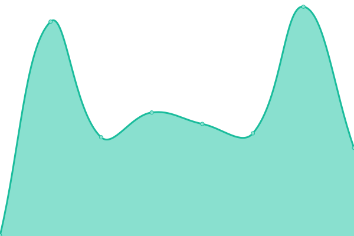
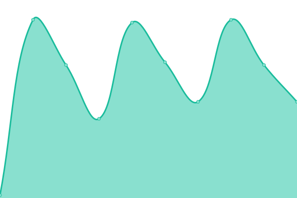

# [📈 Live Status](https://Chief-Engineer.github.io/SS14-Uptime): <!--live status--> **🟩 All systems operational**

This repository contains the open-source uptime monitor and status page for [Chief-Engineer](https://Chief-Engineer.github.io/SS14-Uptime), powered by [Upptime](https://github.com/upptime/upptime).

With [Upptime](https://upptime.js.org), you can get your own unlimited and free uptime monitor and status page, powered entirely by a GitHub repository. We use [Issues](https://github.com/Chief-Engineer/SS14-Uptime/issues) as incident reports, [Actions](https://github.com/Chief-Engineer/SS14-Uptime/actions) as uptime monitors, and [Pages](https://Chief-Engineer.github.io/SS14-Uptime) for the status page.

<!--start: status pages-->
<!-- This summary is generated by Upptime (https://github.com/upptime/upptime) -->
<!-- Do not edit this manually, your changes will be overwritten -->
<!-- prettier-ignore -->
| URL | Status | History | Response Time | Uptime |
| --- | ------ | ------- | ------------- | ------ |
|  [spacestation14.com](https://spacestation14.com/) | 🟩 Up | [spacestation14-com.yml](https://github.com/Chief-Engineer/SS14-Uptime/commits/HEAD/history/spacestation14-com.yml) | 

 149ms
     
 | 

<a href="https://Chief-Engineer.github.io/SS14-Uptime/history/spacestation14-com">100.00%</a>
    

|  [SS14 Forums](https://forum.spacestation14.com/) | 🟩 Up | [ss-14-forums.yml](https://github.com/Chief-Engineer/SS14-Uptime/commits/HEAD/history/ss-14-forums.yml) | 

 1143ms
     
 | 

<a href="https://Chief-Engineer.github.io/SS14-Uptime/history/ss-14-forums">99.84%</a>
    

|  [SS14 Wiki](https://wiki.spacestation14.io/) | 🟩 Up | [ss-14-wiki.yml](https://github.com/Chief-Engineer/SS14-Uptime/commits/HEAD/history/ss-14-wiki.yml) | 

 1220ms
     
 | 

<a href="https://Chief-Engineer.github.io/SS14-Uptime/history/ss-14-wiki">99.85%</a>
    

|  SS14 Auth | 🟩 Up | [ss-14-auth.yml](https://github.com/Chief-Engineer/SS14-Uptime/commits/HEAD/history/ss-14-auth.yml) | 

 1111ms
     
 | 

<a href="https://Chief-Engineer.github.io/SS14-Uptime/history/ss-14-auth">96.92%</a>
    

|  [SS14 Hub](https://hub.spacestation14.com/api/servers) | 🟩 Up | [ss-14-hub.yml](https://github.com/Chief-Engineer/SS14-Uptime/commits/HEAD/history/ss-14-hub.yml) | 

 995ms
     
 | 

<a href="https://Chief-Engineer.github.io/SS14-Uptime/history/ss-14-hub">96.25%</a>
    

|  [SS14 CDN (Server Builds)](https://wizards.cdn.spacestation14.com/fork/wizards) | 🟩 Up | [ss-14-cdn-server-builds.yml](https://github.com/Chief-Engineer/SS14-Uptime/commits/HEAD/history/ss-14-cdn-server-builds.yml) | 

 598ms
     
 | 

<a href="https://Chief-Engineer.github.io/SS14-Uptime/history/ss-14-cdn-server-builds">100.00%</a>
    

|  [Wizard's Den Lizard](https://lizard.spacestation14.io/server/status) | 🟩 Up | [wizard-s-den-lizard.yml](https://github.com/Chief-Engineer/SS14-Uptime/commits/HEAD/history/wizard-s-den-lizard.yml) | 

 346ms
     
 | 

<a href="https://Chief-Engineer.github.io/SS14-Uptime/history/wizard-s-den-lizard">94.46%</a>
    

|  [Wizard's Den Leviathan](https://leviathan.spacestation14.com/server/status) | 🟩 Up | [wizard-s-den-leviathan.yml](https://github.com/Chief-Engineer/SS14-Uptime/commits/HEAD/history/wizard-s-den-leviathan.yml) | 

 151ms
     
 | 

<a href="https://Chief-Engineer.github.io/SS14-Uptime/history/wizard-s-den-leviathan">97.24%</a>
    

|  [Wizard's Den Salamander](https://lizard.spacestation14.io/salamander/status) | 🟩 Up | [wizard-s-den-salamander.yml](https://github.com/Chief-Engineer/SS14-Uptime/commits/HEAD/history/wizard-s-den-salamander.yml) | 

 45ms
     
 | 

<a href="https://Chief-Engineer.github.io/SS14-Uptime/history/wizard-s-den-salamander">99.83%</a>
    

|  [Wizard's Den Miros](https://miros.spacestation14.io/server/status) | 🟩 Up | [wizard-s-den-miros.yml](https://github.com/Chief-Engineer/SS14-Uptime/commits/HEAD/history/wizard-s-den-miros.yml) | 

 582ms
     
 | 

<a href="https://Chief-Engineer.github.io/SS14-Uptime/history/wizard-s-den-miros">100.00%</a>
    

|  [Wizard's Den Vulture](https://leviathan.spacestation14.com/vulture/status) | 🟩 Up | [wizard-s-den-vulture.yml](https://github.com/Chief-Engineer/SS14-Uptime/commits/HEAD/history/wizard-s-den-vulture.yml) | 

 33ms
     
 | 

<a href="https://Chief-Engineer.github.io/SS14-Uptime/history/wizard-s-den-vulture">99.71%</a>
    

|  [Wizard's Den Farm Grass Hopper](https://one.rain.spacestation14.com/one/status) | 🟩 Up | [wizard-s-den-farm-grass-hopper.yml](https://github.com/Chief-Engineer/SS14-Uptime/commits/HEAD/history/wizard-s-den-farm-grass-hopper.yml) | 

 137ms
     
 | 

<a href="https://Chief-Engineer.github.io/SS14-Uptime/history/wizard-s-den-farm-grass-hopper">99.16%</a>
    

<!--end: status pages-->

[**Visit our status website →**](https://Chief-Engineer.github.io/SS14-Uptime)

## 📄 License

- Powered by: [Upptime](https://github.com/upptime/upptime)
- Code: [MIT](./LICENSE) © [Anand Chowdhary](https://anandchowdhary.com), supported by [Pabio](https://pabio.com)
- Data in the `./history` directory: [Open Database License](https://opendatacommons.org/licenses/odbl/1-0/)
